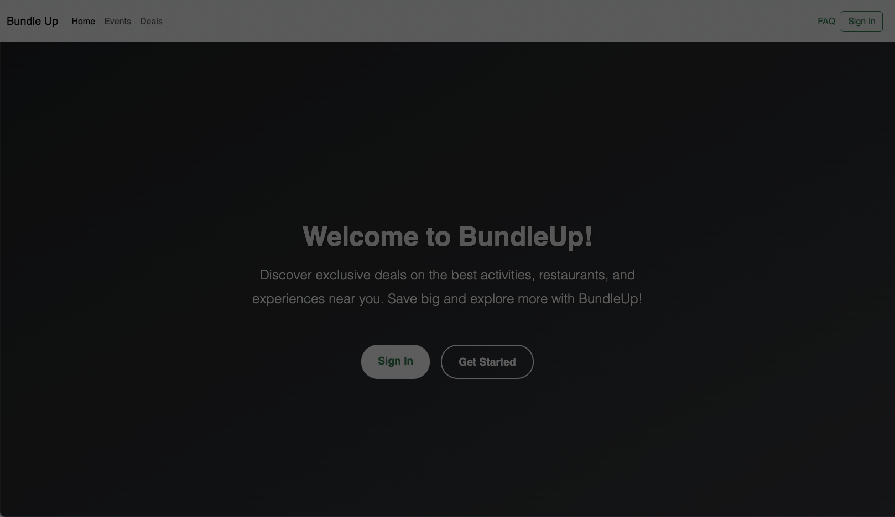

# BundleUp

## Description

BundleUp is a website aimed at bringing prices down for the consumers by buying in mass. This applies to groupon style events, promises of contribution as consumers "go in" on buying large quantities of a product to get the best deal, posting events and deals you find as a consumer or offers as a vendor, and so much more! As people living in this turbulent time, our group likes buying smart - whether that's through costco deals or groupon. BundleUp is our solution for finding a way to easily access the best deals on the market.

This was a former group project that I have since updated and debugged.

## Getting Started

Final Product: https://bundle-up.netlify.app/
Backend: https://github.com/camdelay16/BundleUp_Express

## Attributions

- https://www.npmjs.com/package/react-datetime
- https://getbootstrap.com/
- Additionally, we referenced GA class materials and used the Google AI feature for answering some questions.

## Technologies

In order to run locally, the front-end application requires the following:

- Axios
- React Router Dom
- React Date Picker

And the backend requires the following:

- bcrypt
- body-parser
- cors
- dotenv
- express
- jsonwebtoken
- mongoose
- morgan
- nodemon

## Former Group Project

Our final product: https://bundleup-ga.netlify.app/
Our backend: https://github.com/kpthanh01/BundleUp_Express
